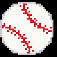

# led-ticker-baseball

MLB scores and standings widgets, a rolling-baseball sprite transition, and a `:baseball.ball:` emoji for [led-ticker](https://github.com/JamesAwesome/led-ticker). Live game data comes from MLB's free StatsAPI — no API key required.

## Screenshots


The `:baseball.ball:` emoji (8×8 and the 32×32 hi-res upgrade on bigsign):

 

## Prerequisites

- A working [led-ticker](https://github.com/JamesAwesome/led-ticker) install.
- Internet access on the Pi (the widgets call MLB's free StatsAPI; no API key needed).

## Install

This plugin auto-registers via the `led_ticker.plugins` entry point — once the package is installed, no `[plugins]` config change is needed.

**Into a containerized led-ticker (recommended):** the plugin is already listed in `config/requirements-plugins.example.txt`. Copy that to the live file and rebuild:

```bash
# in your led-ticker checkout
cp config/requirements-plugins.example.txt config/requirements-plugins.txt
docker compose up -d --build
```

That example file lists every first-party plugin — trim the live copy to just the ones you want. The baseball line is:

```text
git+https://github.com/JamesAwesome/led-ticker-baseball.git@main
```

**Standalone (a venv that already has led-ticker):**

```bash
pip install "git+https://github.com/JamesAwesome/led-ticker-baseball.git@main"
```

led-ticker isn't on PyPI, so this path only works where led-ticker is already installed. See the led-ticker [Plugins docs](https://docs.ledticker.dev/plugins/) for the constraint-based install the Docker image uses.

Once installed, the `baseball.scores` / `baseball.standings` / `baseball.promotions` / `baseball.statcast` widgets, the `baseball.roll*` transitions, and the `:baseball.ball:` emoji are available automatically.

## Widgets

Each widget below is a `[[playlist.section.widget]]` block you add inside a playlist section of your `config/config.toml`. New to led-ticker configs? The [first-config tutorial](https://docs.ledticker.dev/tutorial/02-first-config/) walks through the overall structure — the blocks here show just the baseball-specific keys.

### `baseball.scores`

Fetches live game state for a tracked team and renders its current series. Three layouts:

- **`layout = "ticker"` (default)** — a scrolling line. Pre-game `NYY @ BOS  Today 7:05 PM`; live `NYY 3 BOS 5 ▲6 ◇◆◇ 1·2·1` (score + inning + bases + balls·strikes·outs in color); final `NYY 4 BOS 5 (Final)` (win green, loss red); postponed `NYY @ BOS (PPD: Rain)`. Spring Training / All-Star games append `(ST)` / `(ASG)`.
- **`layout = "scoreboard"`** — a two-column board for bigsign/longboi: away name+score left, home name+score right, center zone shows inning+outs (top) and B/S count + base diamonds (bottom). Names in brand colors; scores green/red on final; base diamonds yellow (occupied) / dim grey (empty). ABS-challenge dashes appear in the bottom corners when active.
- **`layout = "two_row"`** — a held top band (series title) over a scrolling bottom band (the per-game line). Use the `top_*` font options below to size the top band; sized for bigsign.

```toml
[[playlist.section.widget]]
type = "baseball.scores"
team = "NYY"
timezone = "America/New_York"  # set to your local timezone
```

**`team` is the only required field** — everything below is optional tuning.

| Option | Type | Default | Description |
|--------|------|---------|-------------|
| `team` | string | required | MLB team abbreviation, 2–3 letters (e.g. `"NYY"`, `"KC"`, `"SD"`) — see [Team codes](#team-codes). Case-insensitive. |
| `layout` | string | `"ticker"` | `"ticker"`, `"scoreboard"`, or `"two_row"`. |
| `timezone` | string | `"America/New_York"` | IANA timezone for game-time formatting. |
| `padding` | int | `6` | Horizontal padding (logical px) after each message when scrolling (ticker). |
| `final_hold_hours` | int | `6` | Hours after a game ends to keep showing the final score. |
| `bg_color` | RGB list | none | Background fill behind all game messages. |
| `font_color` | RGB list / string / table | unset | Override all text color; default keeps per-segment brand/win-loss colors. |
| `font` | string | `"6x12"` | Font for names and scores. Hires name (e.g. `"Inter-Regular"`) needs `font_size`. |
| `font_size` | int | none | Point size; required for a hires (TTF/OTF) `font`. |
| `font_threshold` | int | `128` | Hires anti-alias threshold (0–255); `80` suits Inter Regular. |
| `small_font` | string | same as `font` | Center-zone font (scoreboard layout). |
| `small_font_size` | int | none | Point size for `small_font`. |
| `small_font_threshold` | int | same as `font_threshold` | Anti-alias threshold for `small_font`. |
| `top_font` | string | same as `font` | Top-band font (`two_row` layout only). |
| `top_font_size` | int | none | Point size for `top_font` (`two_row` only). |
| `top_font_threshold` | int | same as `font_threshold` | Anti-alias threshold for `top_font` (`two_row` only). |
| `top_row_height` | int | half the canvas | Height (logical px) of the held top band (`two_row` only). |
| `update_interval` | int | `300` | Seconds between StatsAPI fetches. |

> `top_*` options apply only with `layout = "two_row"` — the widget rejects them at config-load under other layouts.

### `baseball.standings`

Fetches overall MLB standings and scrolls them as `rank. TeamName W-L GB`, each name in its brand color. Shows the top-N plus any tracked `teams` not already in that list. Offseason-aware: before the season starts it shows `Opens Mar 27`; between the World Series and Spring Training it keeps the prior final standings.

```toml
[[playlist.section.widget]]
type = "baseball.standings"
teams = ["NYY", "BOS"]
```

**`teams` is the only required field** — everything below is optional.

| Option | Type | Default | Description |
|--------|------|---------|-------------|
| `teams` | list of strings | required | Tracked team abbreviations (e.g. `["NYY", "BOS"]`); always shown even outside top-N. |
| `top_n` | int | `3` | Overall top teams to show before tracked teams. `0` = tracked only. |
| `title` | string | `"MLB Standings"` | Section header before the list. |
| `timezone` | string | `"America/New_York"` | IANA timezone for offseason detection / opening-day date. |
| `padding` | int | `6` | Horizontal padding (logical px) after each message. |
| `bg_color` | RGB list | none | Background fill behind the standings. |
| `font_color` | RGB list / string / table | unset | Override all text color; default keeps rank white + team brand colors. |
| `font` | string | `"6x12"` | BDF or hires font for standings text. |
| `update_interval` | int | `86400` | Seconds between fetches (24 h default; standings move slowly). |

### `baseball.promotions`

Upcoming home-game promotions — giveaways and theme nights, e.g. the Blue Jays'
Loonie Dogs Night — for a tracked team, from the schedule API's promotions feed.
Shows today's promos when there's a home game today, otherwise the next home
game's, one scrolling line per promo led by the team abbreviation in its brand
color, with a grey date prefix: `TOR Jun 22 · Retro Domer Hat Giveaway`. Sponsor tails ("presented by …") are
stripped, and near-duplicate feed entries are collapsed. Promos matching
`highlight` render in amber and sort first.

```toml
[[playlist.section.widget]]
type = "baseball.promotions"
team = "TOR"
highlight = ["Loonie Dogs"]
```

**`team` is the only required field** — everything below is optional tuning.

| Option | Type | Default | Description |
|--------|------|---------|-------------|
| `team` | string | required | MLB team abbreviation — see [Team codes](#team-codes). Case-insensitive. |
| `highlight` | list of strings | `[]` | Case-insensitive substrings; matching promos render amber and sort first. |
| `filter` | list of strings | `[]` | If non-empty, only promos matching one of these substrings are shown. |
| `limit` | int | `0` | Max promo lines (`0` = all). Applied after highlight sorting, so highlighted promos are never the ones dropped. |
| `lookahead_days` | int | `14` | How far ahead to look for the next home game with promotions. |
| `update_interval` | int | `21600` | Seconds between refreshes (6 h — keeps the "Today" label honest after midnight). |
| `title` | string | `"<Team> Promos"` | Section title override. |
| `timezone` | string | `"America/New_York"` | IANA timezone governing "Today" and date labels. |
| `padding` | int | `6` | Horizontal padding (logical px) after each message when scrolling. |
| `bg_color` | RGB list | none | Background fill behind all messages. |
| `font_color` | RGB list / string / table | unset | RGB list tints the promo names; the team prefix, date label, and amber highlights keep their callout colors. A string/table provider overrides all text, as in the other widgets. |
| `font` | string | `"6x12"` | Display font. Hires name needs `font_size`. |

With nothing to show, the widget falls back to a team-prefixed
`Next home game: Jun 22` (promo-free homestand), `No home games soon`
(road trip), or `Opens <date>` / `Opens soon` (offseason).

### `baseball.statcast`

League-wide daily Statcast superlatives — the longest home run, hardest-hit
ball, and fastest/slowest pitch across all of MLB, re-derived through the day
as games progress. One scrolling line per stat with the value in amber and the
record holder's team abbreviation in its brand color:
`Today · Longest HR 463 ft — Butler OAK`. Mornings fall back to yesterday's
finals (`Yest · …`). Data comes from Baseball Savant's day CSV (an
undocumented endpoint — the widget refreshes at a polite default cadence and
skips the pull entirely when no games are live or newly final).

```toml
[[playlist.section.widget]]
type = "baseball.statcast"
```

**No required fields** — everything below is optional tuning.

| Option | Type | Default | Description |
|--------|------|---------|-------------|
| `stats` | list of strings | all four | Which lines to show, in display order: `"longest_hr"`, `"hardest_hit"`, `"fastest_pitch"`, `"slowest_pitch"`. |
| `update_interval` | int | `1800` | Seconds between refreshes (30 min). A ~10 KB schedule check skips the ~3 MB data pull when nothing changed. |
| `title` | string | `"Statcast"` | Section title override. |
| `timezone` | string | `"America/New_York"` | IANA timezone governing "Today" and the day rollover. |
| `padding` | int | `6` | Horizontal padding (logical px) after each message when scrolling. |
| `bg_color` | RGB list | none | Background fill behind all messages. |
| `font_color` | RGB list / string / table | unset | RGB list tints the stat label and name; the day label, amber value, and team abbr keep their callout colors. A string/table provider overrides all text, as in the other widgets. |
| `font` | string | `"6x12"` | Display font. Hires name needs `font_size`. |

The slowest-pitch line appends the pitch name when known (`69.6 mph (Slow
Curve)`) — that's where the eephus and position-player pitching comedy lives.
With no Statcast data for today or yesterday, the widget falls back to
`Next games: Mar 26` (offseason) or `No games soon`; a fetch failure shows
`No Data`.

## Team codes

All 30 teams (shared by the scores, standings, and promotions widgets — statcast is league-wide):

`ARI` D-backs · `ATL` Braves · `BAL` Orioles · `BOS` Red Sox · `CHC` Cubs · `CIN` Reds · `CLE` Guardians · `COL` Rockies · `CWS` White Sox · `DET` Tigers · `HOU` Astros · `KC` Royals · `LAA` Angels · `LAD` Dodgers · `MIA` Marlins · `MIL` Brewers · `MIN` Twins · `NYM` Mets · `NYY` Yankees · `OAK` Athletics · `PHI` Phillies · `PIT` Pirates · `SD` Padres · `SEA` Mariners · `SF` Giants · `STL` Cardinals · `TB` Rays · `TEX` Rangers · `TOR` Blue Jays · `WSH` Nationals

## Transition

A rolling-baseball sprite transition, registered in three directions:

```toml
transition = "baseball.roll"              # left-to-right
# transition = "baseball.roll_reverse"     # right-to-left
# transition = "baseball.roll_alternating" # alternates each use
```

On a bigsign panel (`default_scale > 1`) the transition automatically renders a hi-res procedurally-rotated ball; on a smallsign it uses the 8-frame lo-res sprite.

## Emoji

`:baseball.ball:` — a white ball with red stitching. Use it inline in any text-bearing widget:

```toml
[[playlist.section.widget]]
type = "message"
text = ":baseball.ball: Play ball!"
```

It renders as an 8×8 sprite, auto-upgrading to a 32×32 hi-res sprite on bigsign.

## Development

led-ticker isn't on PyPI, so this plugin resolves it from a sibling checkout. Clone both side by side:

```
~/projects/.../led-ticker
~/projects/.../led-ticker-baseball
```

```bash
uv sync --extra dev      # resolves led-ticker from ../led-ticker
uv run pytest -q
uv run ruff check src tests
```

The plugin imports only the public `led_ticker.plugin` surface — `tests/test_import_purity.py` enforces it.

## Links

- [led-ticker](https://github.com/JamesAwesome/led-ticker) — the core project
- [Docs site](https://docs.ledticker.dev) · [Plugin system](https://docs.ledticker.dev/plugins/)
